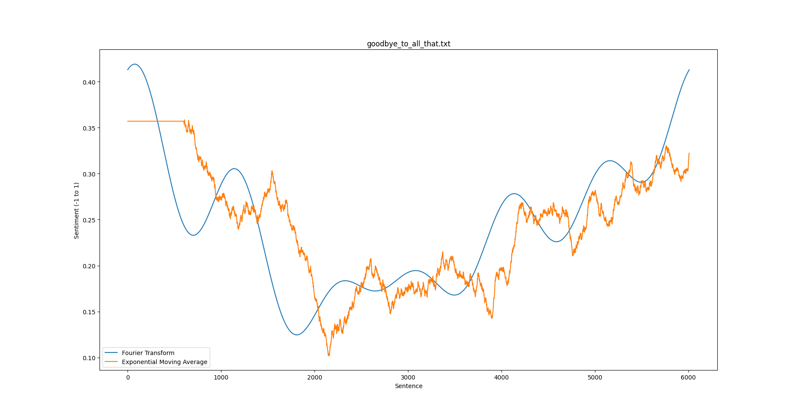
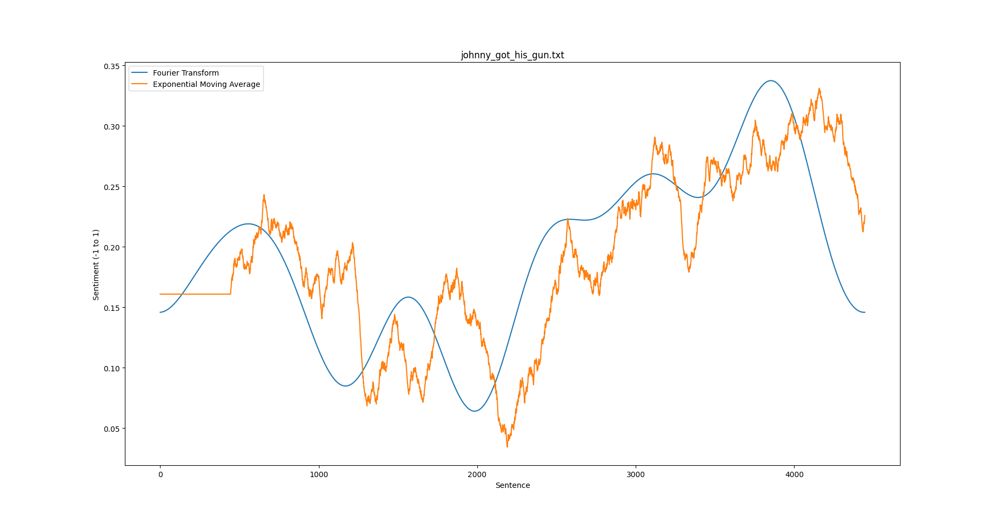
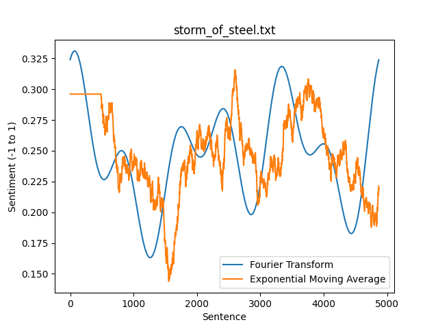

# sentiment-analysis-charts
Create charts of sentiment analysis using BERT

## Requirements
- tensorflow (preferably with CUDA since the BERT model is quite computationally expensive)
- tensorflow_hub
- tensorflow_text
- numpy
- nltk
- matplotlib

## Guide
To create a sentiment analysis chart, execute: `python3 ./src/chart.py FILE_PATH.txt`
For example, try: `python3 ./src/chart.py ./data/all_quiet_on_the_western_front.txt`

## Examples

## Credit
- The code used for training the BERT model on the IMDB dataset is from [TensorFlow's guide](https://www.tensorflow.org/text/tutorials/classify_text_with_bert#sentiment_analysis)
- The code used for performing the exponential moving average is from [Sentdex](https://youtu.be/3y9GESSZmS0)
