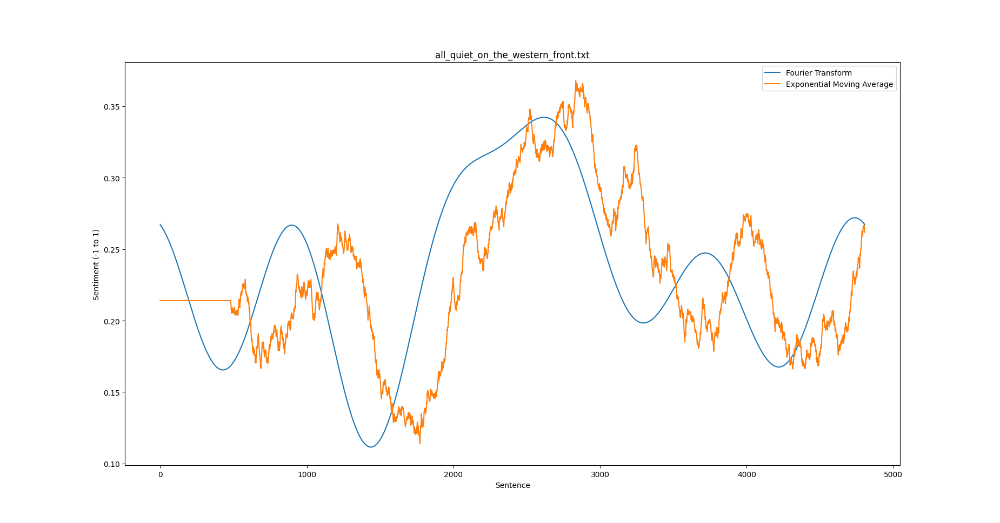

# sentiment-analysis-charts
Create charts of sentiment analysis using BERT

## Requirements
- tensorflow (preferably with CUDA since the BERT model is quite computationally expensive)
- tensorflow_hub
- tensorflow_text
- numpy
- nltk
- matplotlib

## Guide
To create a sentiment analysis chart, execute: `python3 ./src/chart.py FILE_PATH.txt`
For example, try: `python3 ./src/chart.py ./data/all_quiet_on_the_western_front.txt`

## Examples

